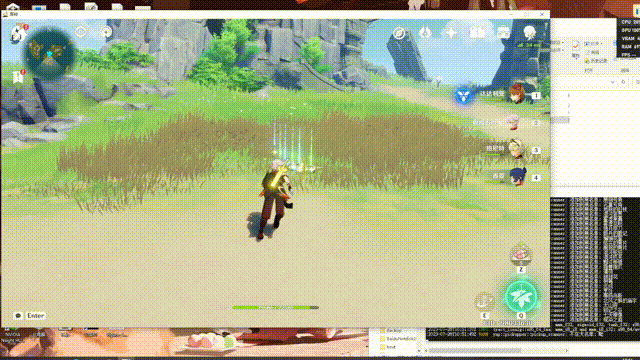
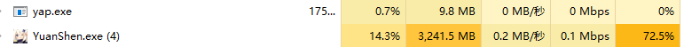

<div align="center">

# Yap
Yet Another Genshin Impact Pickupper

又一个原神拾取器

_Named from [Yas](https://github.com/wormtql/yas)_

</div>

# 介绍

借鉴了[Yas](https://github.com/wormtql/yas)代码实现的自动拾取器。

一个开箱即用、识别飞快、占用资源极低、可配置黑名单的自动拾取器，解放滚轮和拾取键（~~还有Y键probably~~，Y键失效中，待修复），
Which may be the best open source pickupper in terms of performance, usability and configurability.





视频演示：[v0.1.0锄地](https://www.bilibili.com/video/BV1zk4y1G72J) [v0.1.1捡狗粮](https://www.bilibili.com/video/BV1ix4y197nv) （过于老旧了，目前性能更好）

模型训练：[yap-train](https://github.com/Alex-Beng/yap-train)（detach fork from yas-train）

友情链接：[BetterGI--更好的原神](https://github.com/babalae/better-genshin-impact)（更多有用的功能）

# 原理


使用~~基于L*/灰度通道的模板匹配（which is used in other naive pickuppers~~  ~~基于轮廓提取+特征匹配的方案，实现μs级别的拾取键的定位；~~  基于alpha通道实现debug模式都能μs级别的拾取键的定位；
通过固定位置关系截取拾取物的文字；
之后，与[Yas](https://github.com/wormtql/yas)一样，使用SVTR网络对预处理后的区域图片进行识别；


目前的策略是截取包含拾取键上下两个可能存在的拾取物文字，共五个区域。
然后根据黑白名单，利用硬编码的自上而下拾取算法，生成动作序列`ops`，再进行执行。

其中黑白名单的逻辑是：白名单中的**强制**拾取/交互，黑名单仅对不在白名单的生效。

其中，黑名单 = 默认黑名单 + 用户配置黑名单。
**默认黑名单包括了NPC/自机角色、机关/操作/宝箱等探索交互、各种秘境**。

当遇到连续多个（大于等于两个）拾取/交互，或者遇到（白名单内的）调查，会触发**彻底疯狂**，连续按拾取键+滚动10下。

# 使用

目前支持windows，PC客户端（已支持云原神），16:9分辨率。

16:10分辨率拾取处于测试阶段（作者没有硬件来测试），可能会有bug。


全局快捷键见下表：

| 快捷键 | 功能 |
| --- | --- |
| `Alt + 0` | 暂停。切换是否拾取 |
| `Alt + 8` | 切换是否使用单区域模式，便于拾取单个物品，默认关闭 |


隐藏功能见：[other_funcs.md](./other_funcs.md)

## 获取release

目前有两种release，一种是由github actions自动构建的nightly版本，一种是手动构建的release版本。前者可能会有bug，后者较为稳定。

PS：可以使用nightly版本帮助debug。srds，作者已经懒得发手工构建的版本了，直接下最新的nightly即可。

1. 点击[此处](https://github.com/Alex-Beng/Yap/releases)下载release压缩包，解压获得`yap.exe`应用。

2. 如果使用过旧版本，路径下有`black_lists.json`, `white_lists.json`，Yap会自动合并为`config.json`，并删去默认黑名单中存在的交互/物品名称；
如果是第一次使用，Yap也会自动生成一个空白的`config.json`。

2. 使用记事本/VSCode等编辑器打开`config.json`，添加需要拉黑 or 必须交互/拾取的名称，注意需要使用**英文符号**，如：


```json
{
  "black_list": [
    "史莱姆凝液",
    "薄荷",
    "甜甜花",
    "树莓"
  ],
  "white_list": [
    "芙萝拉",
    "调查",
    "薄荷",
    "甜甜花",
    "树莓",
    "传送锚点"
  ]
}
```

3. **可选**: 
<details>
<summary>点击展开/折叠</summary>

使用config.json配置拾取参数、拾取键以及余弦匹配阈值以及其他参数，如：
```json
{
  "black_list": [
    "史莱姆凝液",
    "薄荷",
    "甜甜花",
    "树莓"
  ],
  "white_list": [
    "芙萝拉",
    "调查",
    "薄荷",
    "甜甜花",
    "树莓",
    "传送锚点"
  ],
  "click_tp": false,
  "f_gap": 85,
  "f_internal": 50,
  "infer_gap": 0,
  "scroll_gap": 70,
  "pick_key": "f",
  "cos_thre": 0.9977,
   "uid_mask": true,
    "press_y": true
}
```
| 参数 | 功能 |
| --- | --- |
| `click_tp` | 是否自动点击传送锚点 |
| `f_gap` | 拾取键松开后的冷却时间，单位ms |
| `f_internal` | 拾取键摁下到松开等待时间，单位ms |
| `infer_gap` | 检测间隔，单位ms |
| `scroll_gap` | 滚轮滚动后的冷却时间，单位ms |
| `pick_key` | 拾取键，默认为`f` |
| `cos_thre` | 余弦匹配阈值，越大越严格，越小越宽松 |
| `uid_mask` | 是否生成UID遮罩 |
| `press_y` | 是否自动摁Y键 |

</details>

4. 右键`yap.exe`选择以**管理员身份**运行


4. 性能调优（如果你会使用命令行/json设置参数的话）

## 自行构建

```
cargo build
```

Just enjoy it!


